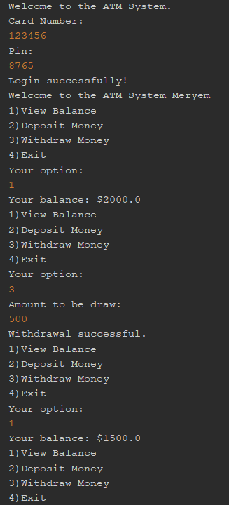
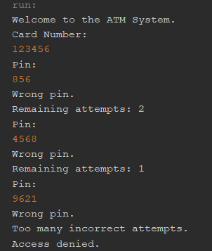

# ATM System-Java
A simple ATM system developed with Java.
# About The Project
The purpose of this project is to practice Java programming concepts such as:
- Object-Oriented Programming (OOP)
- Classes and objects
- Encapsulation
- ArrayList
- Loops
- Conditional statements
- Methods
- Scanner for user input 
# Features
- Card number authentication
- Pin authentication
- Maximum 3 incorrect pin attempts
- Account selection
- View account balance
- Deposit money
- Withdraw money
- Insufficient balance control
- Exit option
# Technologies In Used
- Java
- NetBeans IDE
- Git & GitHub
- Java Swing (planned for future development)
# Account Information
The project currently contains two sample accounts:

User->Card Number->PIN->Balance

Meryem->123456->8765->2000 TL

Ceren->654321->1234->6000 TL

These accounts are only for testing.
# Examples

